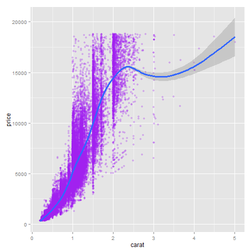
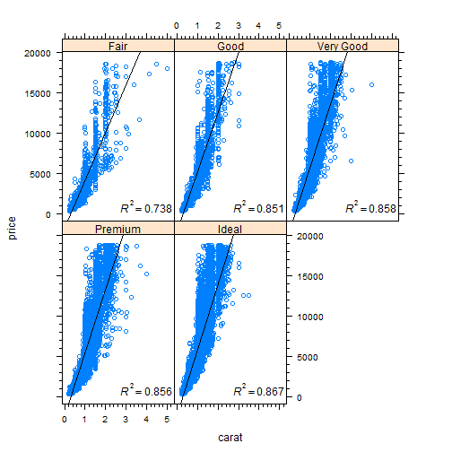

Diamonds Analysis
========================================================
author: Raul Arnau  
date: Mon Nov 24 14:08:48 2014

Overview
========================================================

The application serves as a guide for the first steps during the analysis of a new dataset (in this case the `diamonds` dataset. It is organised in 5 tabbed windows, each one performing a step in the data analysis:

- `Summary`: basic summary of dataset features
- `Table`: complete dataset in a table where features can be selected, sorted and filtered
- `Plot`: relates diamonds price with caret and lets the user change plot properties dynamically
- `Panel Plot`: discriminates diamonds by type of cut quality and shows tendency using a linear regressor goodness of fit as metric 
- `About`: describes the application and include some hints

The following slides include details of each step

Summary
========================================================
In this tab a summary of the complete dataset is printed, showing the available features, their ranges, median, mean, and some other useful stats:


```
     carat              cut        color        clarity     
 Min.   :0.200   Fair     : 1610   D: 6775   SI1    :13065  
 1st Qu.:0.400   Good     : 4906   E: 9797   VS2    :12258  
 Median :0.700   Very Good:12082   F: 9542   SI2    : 9194  
 Mean   :0.798   Premium  :13791   G:11292   VS1    : 8171  
 3rd Qu.:1.040   Ideal    :21551   H: 8304   VVS2   : 5066  
 Max.   :5.010                     I: 5422   VVS1   : 3655  
                                   J: 2808   (Other): 2531  
     depth          table          price             x        
 Min.   :43.0   Min.   :43.0   Min.   :  326   Min.   : 0.00  
 1st Qu.:61.0   1st Qu.:56.0   1st Qu.:  950   1st Qu.: 4.71  
 Median :61.8   Median :57.0   Median : 2401   Median : 5.70  
 Mean   :61.8   Mean   :57.5   Mean   : 3933   Mean   : 5.73  
 3rd Qu.:62.5   3rd Qu.:59.0   3rd Qu.: 5324   3rd Qu.: 6.54  
 Max.   :79.0   Max.   :95.0   Max.   :18823   Max.   :10.74  
                                                              
       y               z        
 Min.   : 0.00   Min.   : 0.00  
 1st Qu.: 4.72   1st Qu.: 2.91  
 Median : 5.71   Median : 3.53  
 Mean   : 5.73   Mean   : 3.54  
 3rd Qu.: 6.54   3rd Qu.: 4.04  
 Max.   :58.90   Max.   :31.80  
                                
```

Table
========================================================
The complete dataset can be accessed and filtered using this widget. As an example, selecting the hole number of features we could see the following for the first 10 observations: 

```
  carat       cut color clarity depth table price    x    y    z
1  0.23     Ideal     E     SI2  61.5    55   326 3.95 3.98 2.43
2  0.21   Premium     E     SI1  59.8    61   326 3.89 3.84 2.31
3  0.23      Good     E     VS1  56.9    65   327 4.05 4.07 2.31
4  0.29   Premium     I     VS2  62.4    58   334 4.20 4.23 2.63
5  0.31      Good     J     SI2  63.3    58   335 4.34 4.35 2.75
6  0.24 Very Good     J    VVS2  62.8    57   336 3.94 3.96 2.48
```


Plot
========================================================

The following figure shows an example of the output for the plot tab, using a purple scatter plot with 0.3 transparency and an auto smoothing curve:

 

Panel plot
========================================================

The following figure shows the the result of the lattice plot relating price with carat for the different values of quality cuts:

 
For each type of cut a regression line is fitted to the data, being R^2 the metric for its goodness of fit.

